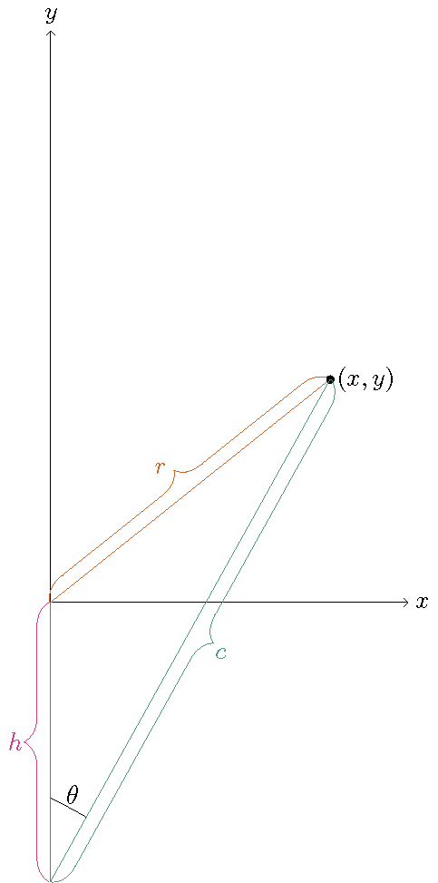
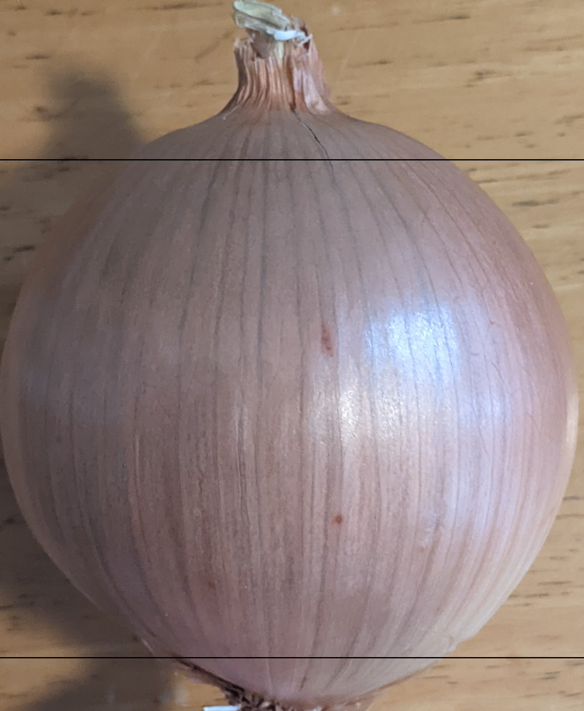
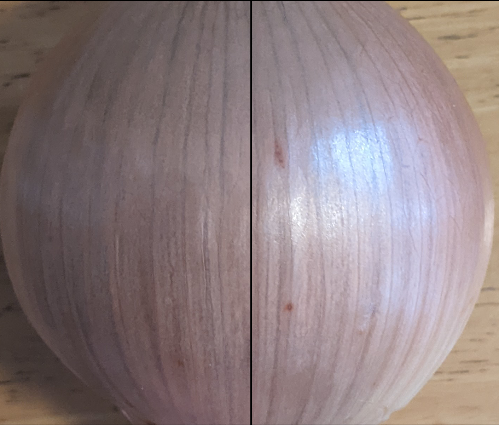
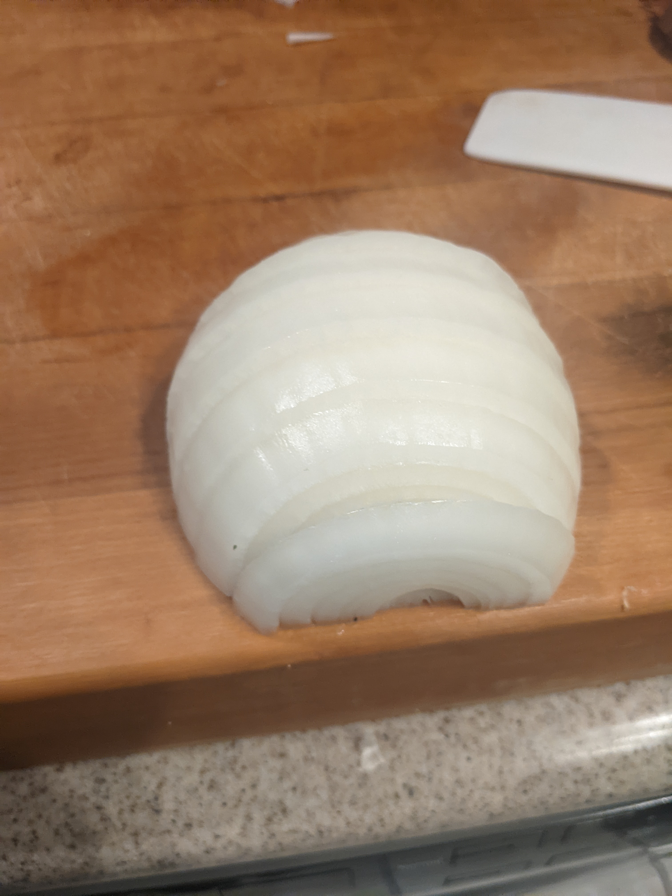
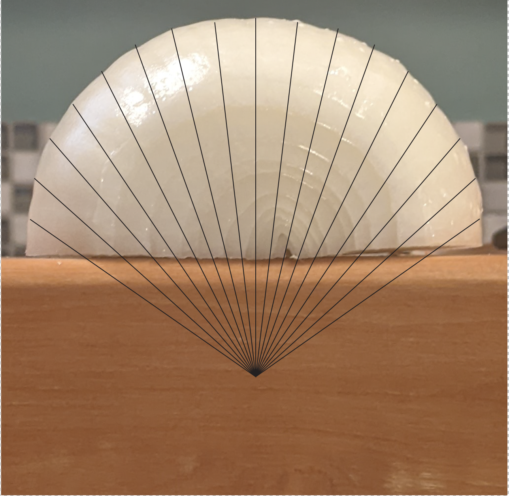
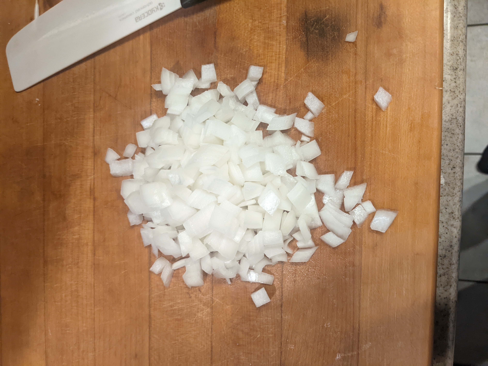

# Finding Mathematical Joy Cutting Onions

Dr. Dylan Poulsen
Washington College

---

# Origin of the Problem

<iframe width="560" height="315" src="https://www.youtube.com/embed/BMgLRD2v5w0?start=141" title="YouTube video player" frameborder="0" allow="accelerometer; autoplay; clipboard-write; encrypted-media; gyroscope; picture-in-picture" allowfullscreen></iframe>

---
# Mathematical Set Up

We want to find the depth below the onion to cut towards in order to minimize the **variance** of the volume of each onion slice.

---
# Mathematical Set Up

The **variance**, $\sigma^2$, of a set of $n$ numbers $S=\{x_1,x_2,\ldots,x_n\}$ whose average value is $\overline{x}$ is
$$
\sigma^2=\frac{1}{N} \sum_{i=1}^{N} (x_i-\overline{x})^2.
$$
That is, the variance is the average of the square deviations from the mean (this will be important later).

---

# Simplifying the Problem

For simplicity, consider a two-dimensional onion.

---

# Simplifying the Problem

Insight: The depth to which you have to aim your knife for radial cuts depends on the number of layers.

---

# Simplifying the Problem

So, we might as well consider the limiting case as the number of layers approaches infinity.

---

# Simplifying the Problem

So, we might as well consider the limiting case as the number of layers approaches infinity.

---

# Simplifying the Problem

Similarly, the number of cuts being made has an effect on the answer. So, for simplicity, we can think of making infinitely many cuts as well.

---

# Live Mathematics

---

# Inspiration: The Jacobian!

Rectangular $\rightarrow$ Polar:
$$
\begin{align}
x & = r \cos(\theta) \\
y & = r \sin(\theta)
\end{align}
$$
$$
\begin{align}
J(r,\theta)  & = \frac{\partial x}{\partial r} \frac{\partial y}{\partial \theta} - \frac{\partial x}{\partial \theta} \frac{\partial y}{\partial r} \\
& = r \cos^2(\theta) + r \sin^2(\theta) \\
& = r
\end{align}
$$

---

# Inspiration: The Jacobian!

Problem: With infinitely many layers and cuts, the area of each piece of onion is zero. So, it is hard to measure variance.

---

# Inspiration: The Jacobian!

Solution: Recognize that the Jacobian $J(r,\theta)=r$ gives a measure of how big the infinitely small pieces are relative to each other. So, we can use the average value of the function $J(r,\theta)=r$ as a stand-in for the average area.

---

# Average of a Function

Fact from Integral Calculus: the average value, $\overline{f}$, of a function $f$ over a region $\Omega$ is
$$
\overline{f} = \frac{\int_{\Omega} f \; dV}{\int_{\Omega} 1 \; dV}.
$$

Here, over a quarter onion of radius 1, the average "relative area", $\overline{A}$, is given by (any guesses?)

---

# Average of a Function

$$
\overline{A} = \frac{\int_{0}^{\pi/2} \int_{0}^{1} r \; dr \; d \theta}{\int_{0}^{\pi/2} \int_{0}^{1} 1 \; dr \; d \theta} = \frac{1}{2}
$$

---

# Variance of a Function

To generalize the variance we saw earlier, we recall the variance is the average of the square deviations from the mean! So, the variance of our relative area is
$$
\sigma^2 = \frac{\int_{0}^{\pi/2} \int_{0}^{1} (r-\overline{A})^2 \; dr \; d \theta}{\int_{0}^{\pi/2} \int_{0}^{1} 1 \; dr \; d \theta} = \frac{\int_{0}^{\pi/2} \int_{0}^{1} (r-1/2)^2 \; dr \; d \theta}{\int_{0}^{\pi/2} \int_{0}^{1} 1 \; dr \; d \theta}=\frac{1}{12}
$$

---

# Rest and Reflect

* All of this is great, but it doesn't answer the question! 

* What allowed all this to work was a coordinate system whose axes cut the onion. 

* Can we find a coordinate system that cuts the onion in the way described by Chef Kenji Lopez-Alt?

---

# New Coordinate System

We make a coordinate system for cutting towards a point a distance $h>0$ below the center of the onion. In this coordinate system, we measure the angle $\theta$ from the point $(0,-h)$, while we measure the radius from the origin $(0,0)$.

---

# New Coordinate System

This coordinate system only works for the upper half plane, as there are now technically two points in the plane for a given point $(r,\theta)$.

---

# Game Plan

In order to mimic our computation for polar coordinates, we need to 
1) define the region and 
2) compute the Jacobian.

---

# Define the Region

Fix $\theta$. What is the range of $r$?

---

# Define the Region

$$
\tan(\theta)=\frac{r}{h}
$$

---

# Define the Region

So, $r$ ranges from $h \tan(\theta)$ to 1.

---

# Define the Region

Also, $\theta$ ranges from $0$ to $\arctan(1/h)$

---

# The Jacobian
In order to compute the Jacobian
$$
J(r,\theta) = \frac{\partial x}{\partial r} \frac{\partial y}{\partial \theta} - \frac{\partial x}{\partial \theta} \frac{\partial y}{\partial r},
$$
We need to know what is the relationship between $(x,y)$ and $(r,\theta)$ in this coordinate system?

---

# The Jacobian

Define $c$ to be the distance from the point $(0,-h)$ to a given point $(x,y)$ (both in the rectangular coordinate system).

Using the law of cosines, we can calculate
$$
c=h \cos(\theta)+\sqrt{r^2-h^2\sin^2(\theta)}.
$$

---

# The Jacobian

With 
$$
c=h \cos(\theta)+\sqrt{r^2-h^2\sin^2(\theta)}.
$$
$$
\begin{align*}
x & = c \sin(\theta) \\
y & = c \cos(\theta)-h
\end{align*}
$$

---

# The Jacobian

From this, for a given depth $h$, we can calculate the Jacobian as
$$
\begin{align*}
\scriptscriptstyle J(r,\theta) =& \scriptscriptstyle \frac{r \cos (\theta ) \left(\sin (\theta ) \left(-\frac{h^2 \sin (\theta ) \cos (\theta )}{\sqrt{r^2-h^2 \sin ^2(\theta )}}-h \sin (\theta )\right)+\cos (\theta ) \left(\sqrt{r^2-h^2 \sin ^2(\theta )}+h \cos (\theta )\right)\right)}{\sqrt{r^2-h^2 \sin ^2(\theta )}}\\
& \scriptscriptstyle -\frac{r \sin (\theta ) \left(\cos (\theta ) \left(-\frac{h^2 \sin (\theta ) \cos (\theta )}{\sqrt{r^2-h^2 \sin ^2(\theta )}}-h \sin (\theta )\right)-\sin (\theta ) \left(\sqrt{r^2-h^2 \sin ^2(\theta )}+h \cos (\theta )\right)\right)}{\sqrt{r^2-h^2 \sin ^2(\theta )}}.
\end{align*}
$$

Yikes!

---

# Executing the Plan

Despite how difficult the Jacobian looks, we can proceed as we did before. Putting the pieces our plan together, we need to first compute
$$
\begin{align*}
\overline{A}(h) &= \frac{\int_{0}^{\arctan(1/h)} \int_{h \tan(\theta)}^{1} J(r,\theta) \; dr \; d\theta}{\int_{0}^{\arctan(1/h)} \int_{h \tan(\theta)}^{1} 1 \; dr \; d \theta}.
\end{align*}
$$

Amazingly, this is not as bad as it looks (even though Mathematica cannot do it).

---

# Executing the Plan

Let's look at the numerator
$$
\int_{0}^{\arctan(1/h)} \int_{h \tan(\theta)}^{1} J(r,\theta) \; dr \; d\theta.
$$

---

# Executing the Plan

Let's look at the numerator
$$
\int_{0}^{\arctan(1/h)} \int_{h \tan(\theta)}^{1} J(r,\theta) \; dr \; d\theta.
$$

If we go back to the rectangular coordinate system, this would simply be the integral of $1$ over the region we define to be the onion. That is, it's the area of the quarter onion so this integral is just $\pi/4$.

---

# Executing the Plan

Now let's look at the denominator
$$
\int_{0}^{\arctan(1/h)} \int_{h \tan(\theta)}^{1} 1 \; dr \; d \theta.
$$

---

# Executing the Plan

Now let's look at the denominator
$$
\int_{0}^{\arctan(1/h)} \int_{h \tan(\theta)}^{1} 1 \; dr \; d \theta.
$$

This is fairly easy to do as well. We can see the denominator is equal to 
$$
\left(\arctan \left(\frac{1}{h}\right)-\frac{1}{2} h \ln \left(\frac{1}{h^2}+1\right)\right).
$$

---

# Executing the Plan

In all, the average ``relative area'' of each piece is 
$$
\overline{A}(h) = \frac{\pi }{4 \left(\arctan \left(\frac{1}{h}\right)-\frac{1}{2} h \ln \left(\frac{1}{h^2}+1\right)\right)}.
$$

---

# Executing the Plan

$$
\begin{align*}
\sigma^2(h) &= \frac{\int_{0}^{\arctan(1/h)} \int_{h \tan(\theta)}^{1} (J(r,\theta)-\overline{A}(h))^2 \; dr \; d\theta}{\int_{0}^{\arctan(1/h)} \int_{h \tan(\theta)}^{1} \; dr \; d \theta}. \\
& = \frac{\int_{0}^{\arctan(1/h)} \int_{h \tan(\theta)}^{1} (J(r,\theta))^2 \; dr \; d\theta}{\int_{0}^{\arctan(1/h)} \int_{h \tan(\theta)}^{1} \; dr \; d \theta} - (\overline{A}(h))^2 \\
& = \frac{\int_{0}^{\arctan(1/h)} \int_{h \tan(\theta)}^{1} (J(r,\theta))^2 \; dr \; d\theta}{\arctan \left(\frac{1}{h}\right)-\frac{1}{2} h \ln \left(\frac{1}{h^2}+1\right)} - (\overline{A}(h))^2.
\end{align*}
$$

---

# Reducing the Problem

So, finding $\sigma^2(h)$ in a closed form reduces to evaluating
$$
f(h):=\int_{0}^{\arctan(1/h)} \int_{h \tan(\theta)}^{1} (J(r,\theta))^2 \; dr \; d\theta.
$$

---

# Reducing the Problem

* This integral cannot be evaluated by Mathematica. We can be clever, though. 

* We can go *back* to the Cartesian coordinate system using $r=\sqrt{x^2+y^2}$ and $\theta=\arctan\left(\frac{x}{y+h}\right)$.  The Jacobian for this transformation is $1/J(r,\theta)$.

---

# Reducing the Problem
$$
\begin{align*}
f(h) &= \int_{0}^{1} \int_{0}^{\sqrt{1-x^2}} J(r,\theta) dy dx \\
 &= \int_{0}^{1} \int_{0}^{\sqrt{1-x^2}} J\left(\sqrt{x^2+y^2},\arctan\left(\frac{x}{y+h}\right)\right) dy dx\\
 &=\int_{0}^{1} \int_{0}^{\sqrt{1-x^2}} \frac{\sqrt{x^2+y^2} \left((h+y)^2+x^2\right)}{y (h+y)+x^2} dy dx.
\end{align*}
$$

But, here we are integrating over a quarter disc. Wouldn't polar coordinates be easier?

---

Let $x=s \cos(\varphi)$ and $y=s \sin(\varphi)$. Then, assuming $0<h<1$,
$$
\begin{align*}
f(h) & = \int _0^1\int _0^{\frac{\pi }{2}} \frac{\left(h^2+2 h s \sin (\varphi )+s^2\right)}{h \sin (\varphi )+s} s d\varphi ds \\
    & = \frac{1}{6} \left(4 \left(1-h^2\right)^{3/2} \arcsin(h)-4 \left(1-h^2\right)^{3/2} \arctan\left(\frac{h+1}{\sqrt{1-h^2}}\right) \right.\\
    & \left. \vphantom{\frac{h+1}{\sqrt{1-h^2}}} +h^3 \log \left(4 h^2\right)+h+2 \pi \right).
\end{align*}
$$

So, we now have a closed form for $\sigma^2(h)$ (don't make me write it out though).

---

# Rest and Reflect

* Whew! We have done a lot of integration work with three different coordinate systems. What do we have at the end of it?

* We have an expression for the variance of the ``relative area'' as a function of the depth $h$ which we are cutting towards.

* Our goal is to minimize variance. What should we do?

* Take the derivative and set it equal to zero! (then test).

---

# Putting it Together

$$
[\sigma^2(h)]' = \frac{k(h)}{48 \left(\cot ^{-1}(h)-\frac{1}{2} h \log \left(\frac{1}{h^2}+1\right)\right)^3},
$$
where
$$
\begin{align*}
    &\scriptscriptstyle k(h)= \scriptscriptstyle -3 \pi ^2 \log \left(\frac{1}{h^2}+1\right) \\
    & \scriptscriptstyle + 6 \left(h \log \left(\frac{1}{h^2}+1\right)-2 \cot ^{-1}(h)\right)^2 \left(h \left(h \log \left(4 h^2\right)+4 \sqrt{1-h^2} \left(\tan ^{-1}\left(\frac{h+1}{\sqrt{1-h^2}}\right)-\sin ^{-1}(h)\right)\right)+1\right)\\
    & \scriptscriptstyle -2 \log \left(\frac{1}{h^2}+1\right) \left(h \log \left(\frac{1}{h^2}+1\right)-2 \cot ^{-1}(h)\right) \\
    & \scriptscriptstyle \times \left(4 \left(1-h^2\right)^{3/2} \sin ^{-1}(h)-4 \left(1-h^2\right)^{3/2} \tan ^{-1}\left(\frac{h+1}{\sqrt{1-h^2}}\right)+h^3 \log \left(4 h^2\right)+h+2 \pi \right).
\end{align*}
$$

---

# Plot of $[\sigma^2(h)]'$

---

# The (2D) Onion Constant

define ס to be the unique root of $k(h)$ over the interval $0<h<1$. We call ס the onion constant. To fifty decimal places its value is 0.55730669298566447885109305914592718083200030207273...

---

# Three Dimensions

* We can also do a similar analysis in three dimensions. We model the onion as nested spheres. We first cut the onion in half, as before.

* Usually, we cut an onion into slices perpendicular to the root. If we add a $z$ axis, the planes perpendicular to this access cut the onion in this way. So, we can use an analog of cylindrical coordinates (with our distorted "polar" coordinates) to answer the three-dimensional case. 

---

# Three Dimensions

* If we do the same analysis as before, we find the three-dimensional onion constant is approximately 0.484457.

* This is awfully close to 1/2 (an easy number for humans to estimate. What if we add in the fact that usually we cut off the ends of the onion?

---

# Comprehensive Onion Cutting Guide

1) Cut off the ends of the onion, leaving approximately 82.8513\% of the length of the onion in the vertical direction.

---

# Comprehensive Onion Cutting Guide

2) Cut the onion in half perpendicular to the previous two cuts.

---

# Comprehensive Onion Cutting Guide

2) Cut the onion in half perpendicular to the previous two cuts.

---

# Comprehensive Onion Cutting Guide

3) Slice the onion parallel to the direction of your initial cuts and perpendicular to the cutting board up the half-onion.

---

# Comprehensive Onion Cutting Guide

4) For the final cuts, cut perpendicularly to the previous cuts, but for each cut aim towards a spot 50\% of the radius of the onion below the center of the onion.

---

# Comprehensive Onion Cutting Guide

5) Profit

---

# Concluding Thoughts

* Why do this?

* What now?

* What questions do you have?

---

# Resolution from the Chef

