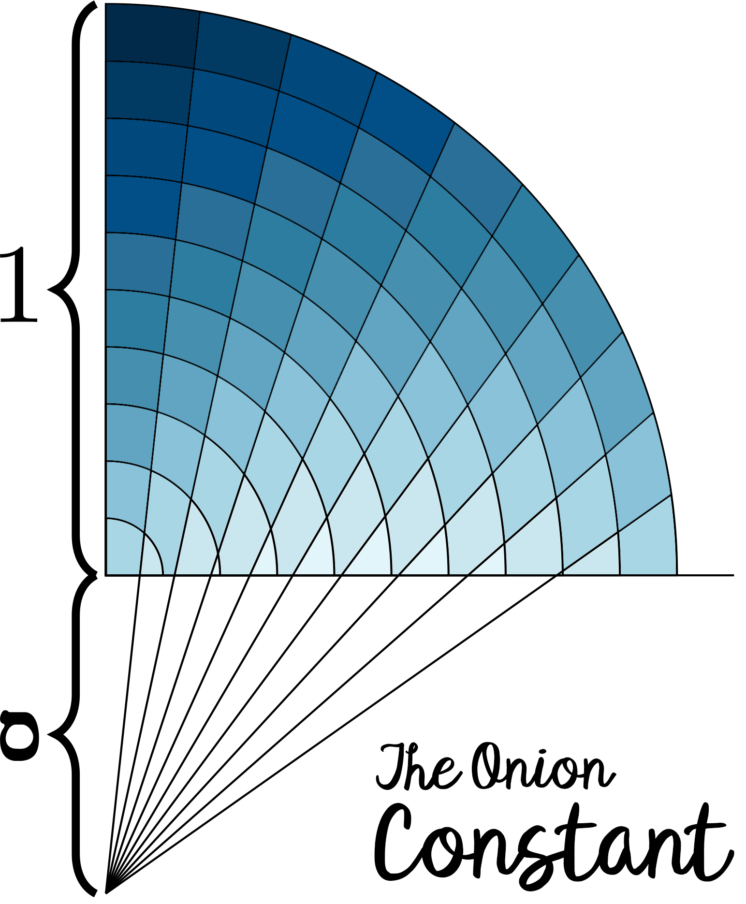
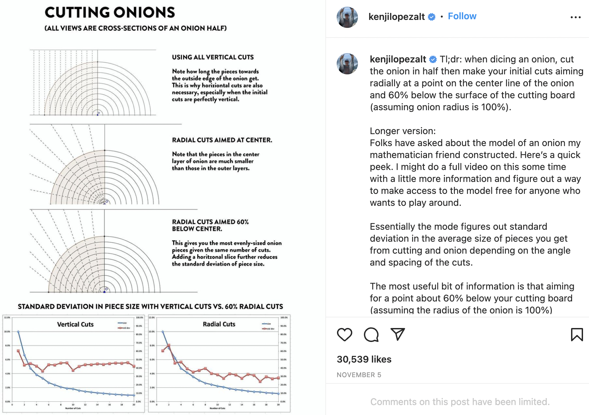
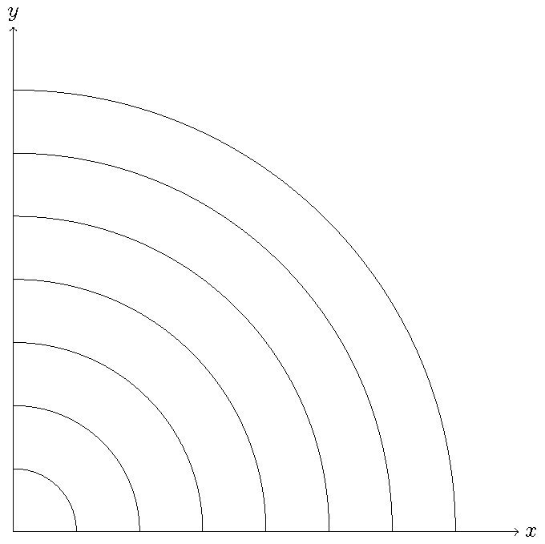
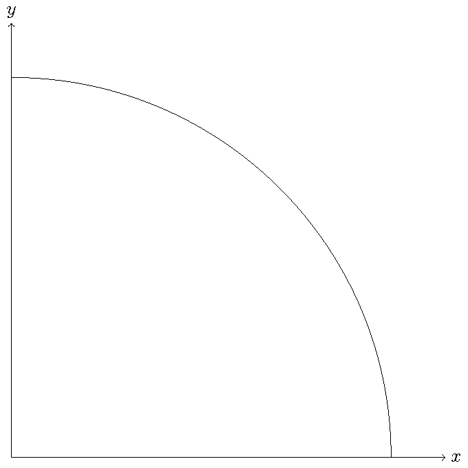
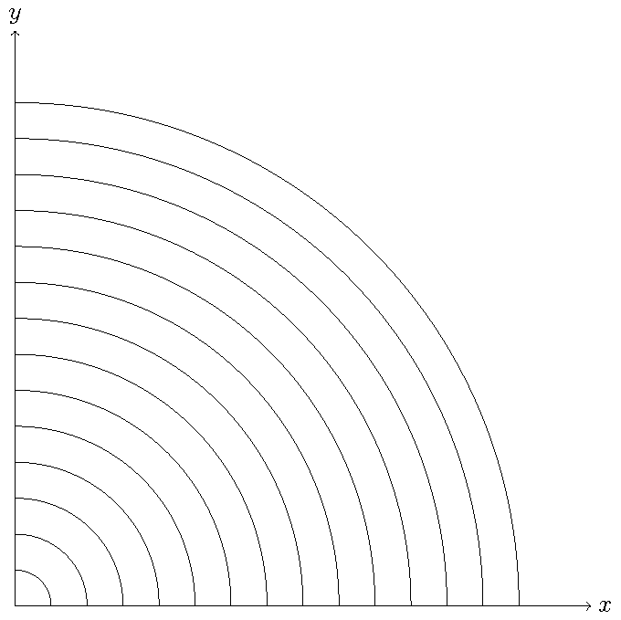
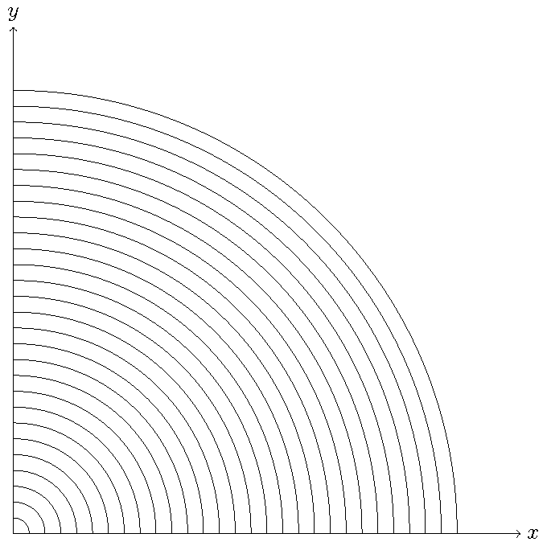
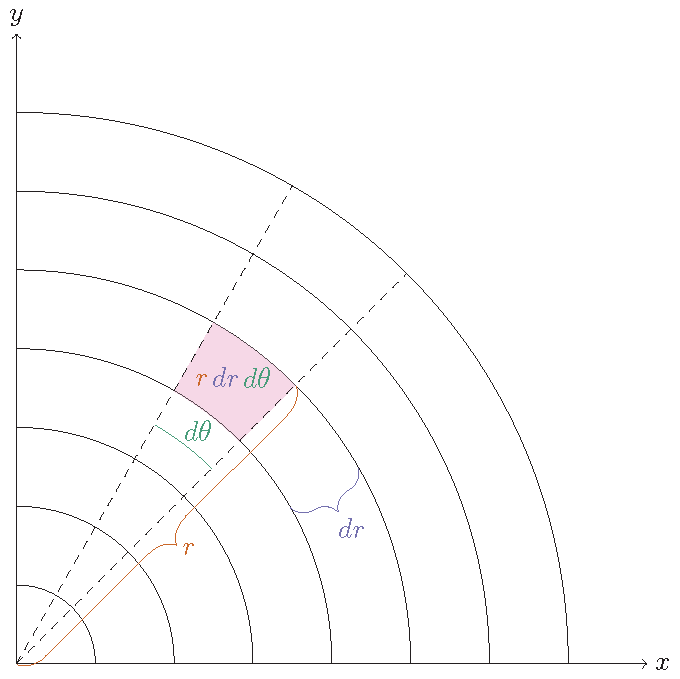

# Finding Mathematical Joy Cutting Onions

Dr. Dylan Poulsen
Washington College

---

# Origin of the Problem

<iframe width="560" height="315" src="https://www.youtube.com/embed/BMgLRD2v5w0?start=141" title="YouTube video player" frameborder="0" allow="accelerometer; autoplay; clipboard-write; encrypted-media; gyroscope; picture-in-picture" allowfullscreen></iframe>

---
# Mathematical Set Up

We want to find the depth below the onion to cut towards in order to minimize the **variance** of the volume of each onion slice.

---
# Mathematical Set Up

The **variance**, $\sigma^2$, of a set of $n$ numbers $S=\{x_1,x_2,\ldots,x_n\}$ whose average value is $\overline{x}$ is
$$
\sigma^2=\frac{1}{N} \sum_{i=1}^{N} (x_i-\overline{x})^2.
$$
That is, the variance is the average of the square deviations from the mean (this will be important later).

---

# Simplifying the Problem

For simplicity, consider a two-dimensional onion.

---

# Simplifying the Problem

Insight: The depth to which you have to aim your knife for radial cuts depends on the number of layers.

---

# Simplifying the Problem

So, we might as well consider the limiting case as the number of layers approaches infinity.

---

# Simplifying the Problem

So, we might as well consider the limiting case as the number of layers approaches infinity.

---

# Simplifying the Problem

Similarly, the number of cuts being made has an effect on the answer. So, for simplicity, we can think of making infinitely many cuts as well.

---

# Live Mathematics

---

# Inspiration: The Jacobian!

Rectangular $\rightarrow$ Polar:
$
x=r \cos(\theta),
$
$
y=r \sin(\theta).
$
$$ J(r,\theta)  = \frac{\partial x}{\partial r} \frac{\partial y}{\partial \theta} - \frac{\partial x}{\partial \theta} \frac{\partial y}{\partial r} = r$$

