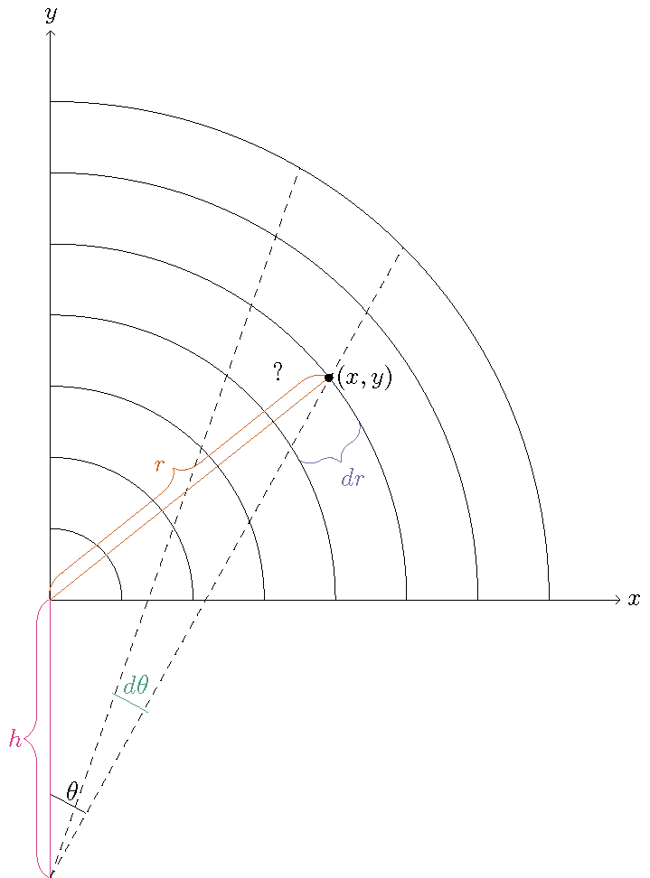
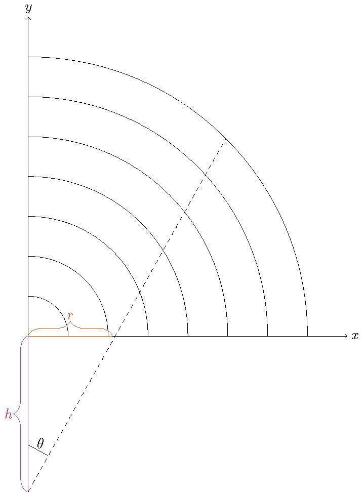
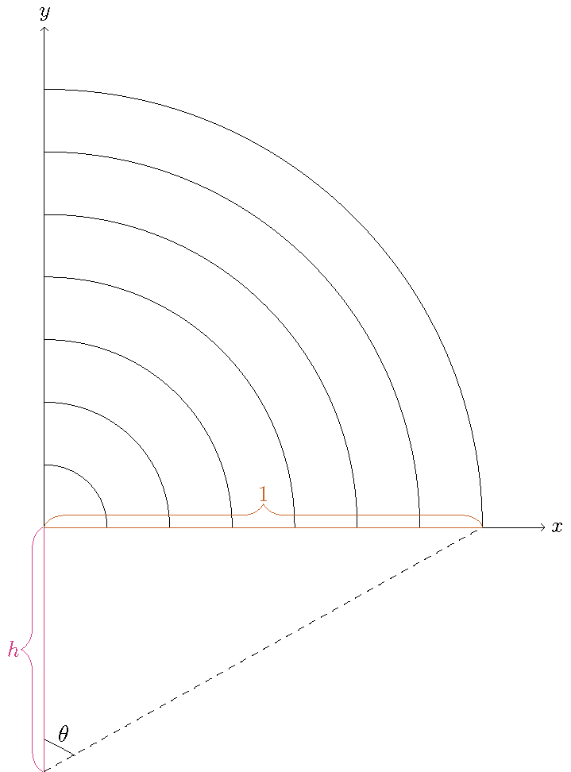

# Finding Mathematical Joy Cutting Onions

Dr. Dylan Poulsen
Washington College

---

# Origin of the Problem

<iframe width="560" height="315" src="https://www.youtube.com/embed/BMgLRD2v5w0?start=141" title="YouTube video player" frameborder="0" allow="accelerometer; autoplay; clipboard-write; encrypted-media; gyroscope; picture-in-picture" allowfullscreen></iframe>

---
# Mathematical Set Up

We want to find the depth below the onion to cut towards in order to minimize the **variance** of the volume of each onion slice.

---
# Mathematical Set Up

The **variance**, $\sigma^2$, of a set of $n$ numbers $S=\{x_1,x_2,\ldots,x_n\}$ whose average value is $\overline{x}$ is
$$
\sigma^2=\frac{1}{N} \sum_{i=1}^{N} (x_i-\overline{x})^2.
$$
That is, the variance is the average of the square deviations from the mean (this will be important later).

---

# Simplifying the Problem

For simplicity, consider a two-dimensional onion.

---

# Simplifying the Problem

Insight: The depth to which you have to aim your knife for radial cuts depends on the number of layers.

---

# Simplifying the Problem

So, we might as well consider the limiting case as the number of layers approaches infinity.

---

# Simplifying the Problem

So, we might as well consider the limiting case as the number of layers approaches infinity.

---

# Simplifying the Problem

Similarly, the number of cuts being made has an effect on the answer. So, for simplicity, we can think of making infinitely many cuts as well.

---

# Live Mathematics

---

# Inspiration: The Jacobian!

Rectangular $\rightarrow$ Polar:
$$
\begin{align}
x & = r \cos(\theta) \\
y & = r \sin(\theta)
\end{align}
$$
$$
\begin{align}
J(r,\theta)  & = \frac{\partial x}{\partial r} \frac{\partial y}{\partial \theta} - \frac{\partial x}{\partial \theta} \frac{\partial y}{\partial r} \\
& = r \cos^2(\theta) + r \sin^2(\theta) \\
& = r
\end{align}
$$

---

# Inspiration: The Jacobian!

Problem: With infinitely many layers and cuts, the area of each piece of onion is zero. So, it is hard to measure variance.

---

# Inspiration: The Jacobian!

Solution: Recognize that the Jacobian $J(r,\theta)=r$ gives a measure of how big the infinitely small pieces are relative to each other. So, we can use the average value of the function $J(r,\theta)=r$ as a stand-in for the average area.

---

# Average of a Function

Fact from Integral Calculus: the average value, $\overline{f}$, of a function $f$ over a region $\Omega$ is
$$
\overline{f} = \frac{\int_{\Omega} f dV}{\int_{\Omega} 1 dV}.
$$

Here, over a quarter onion of radius 1, the average "relative area", $\overline{A}$, is given by (any guesses?)

---

# Average of a Function

$$
\overline{A} = \frac{\int_{0}^{\pi/2} \int_{0}^{1} r dr \; d \theta}{\int_{0}^{\pi/2} \int_{0}^{1} 1 dr \; d \theta} = \frac{1}{2}
$$

---

# Variance of a Function

To generalize the variance we saw earlier, we recall the variance is the average of the square deviations from the mean! So, the variance of our relative area is
$$
\sigma^2 = \frac{\int_{0}^{\pi/2} \int_{0}^{1} (r-\overline{A})^2 dr \; d \theta}{\int_{0}^{\pi/2} \int_{0}^{1} 1 dr \; d \theta} = \frac{\int_{0}^{\pi/2} \int_{0}^{1} (r-1/2)^2 dr \; d \theta}{\int_{0}^{\pi/2} \int_{0}^{1} 1 dr \; d \theta}=\frac{1}{12}
$$

---

# Rest and Reflect

* All of this is great, but it doesn't answer the question! 

* What allowed all this to work was a coordinate system whose axes cut the onion. 

* Can we find a coordinate system that cuts the onion in the way described by Chef Kenji Lopez-Alt?

---

# New Coordinate System

We make a coordinate system for cutting towards a point a distance $h>0$ below the center of the onion. In this coordinate system, we measure the angle $\theta$ from the point $(0,-h)$, while we measure the radius from the origin $(0,0)$.

---

# New Coordinate System

This coordinate system only works for the upper half plane, as there are now technically two points in the plane for a given point $(r,\theta)$.

---

# Game Plan

In order to mimic our computation for polar coordinates, we need to 
1) define the region and 
2) compute the Jacobian.

---

# Define the Region

Fix $\theta$. What is the range of $r$?

---

# Define the Region

$$
\tan(\theta)=\frac{r}{h}
$$

---

# Define the Region

So, $r$ ranges from $h \tan(\theta)$ to 1.

---

# Define the Region

Also, $\theta$ ranges from $0$ to $\arctan(1/h)$

---

# The Jacobian
In order to compute the Jacobian
$$
J(r,\theta) = \frac{\partial x}{\partial r} \frac{\partial y}{\partial \theta} - \frac{\partial x}{\partial \theta} \frac{\partial y}{\partial r},
$$
We need to know what is the relationship between $(x,y)$ and $(r,\theta)$ in this coordinate system?

---

# The Jacobian

Define $c$ to be the distance from the point $(0,-h)$ to a given point $(x,y)$ (both in the rectangular coordinate system).

Using the law of cosines, we can calculate
\[
c=h \cos(\theta)+\sqrt{r^2-h^2\sin^2(\theta)}.
\]